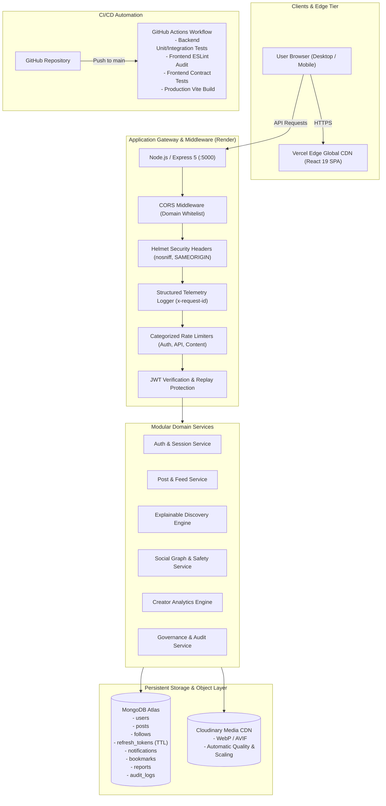

# PostHub 4.0 — Production-Grade Social Community Platform

> **"A scalable, production-style social community platform engineered for creators, developers, and collaborative networks."**

PostHub is a full-stack platform built with **React 19**, **Vite**, **Bootstrap 5**, **Node.js**, **Express 5**, **MongoDB Atlas**, **Cloudinary**, and a production DevOps pipeline.

[](https://reactjs.org/)
[](https://nodejs.org/)
[](https://expressjs.com/)
[](https://www.mongodb.com/)
[](https://getbootstrap.com/)
[](https://github.com/naina766/PostDashboardApp/actions)
[](LICENSE)

---

## 🌐 Live Demonstrations & Deployment Topology

| Component | Target Platform | URL / Endpoint |
| :--- | :--- | :--- |
| **Frontend Application** | **Vercel** | [https://posthub-community.vercel.app](https://posthub-community.vercel.app) *(Deployment Target)* |
| **Backend REST API** | **Render** | [https://posthub-backend.onrender.com/api/health](https://posthub-backend.onrender.com/api/health) |
| **Database Cluster** | **MongoDB Atlas** | Managed Replica Set (M0 / M10) |
| **Media CDN** | **Cloudinary** | Global Edge Image Delivery & Transformations |

---

## 🏛️ System Architecture

PostHub utilizes a modern decoupled cloud architecture designed for high availability, zero layout shifts, and resilience.



---

## ⚡ Core Engineering Features

### 1. Dual-Token JWT & Replay Attack Defense
- **15-Minute Access Tokens**: Short-lived stateless authorization signed with `JWT_SECRET`.
- **7-Day Rotating Refresh Tokens**: Cryptographically generated 40-byte hex strings hashed with **SHA-256** prior to MongoDB insertion.
- **Automated Replay Attack Detection**: Presenting a previously revoked token indicates token theft; the server detects the replay, revokes **all active sessions** for that user family, logs an administrative security alert, and rejects the request.

### 2. Explainable Community Discovery Engine
- PostHub rejects opaque algorithms in favor of transparent recommendation signals:
  - `"Because you follow this creator"`: Author is in direct social graph.
  - `"Trending in #tag"`: Trending score exceeds engagement threshold for active hashtag.
  - `"Popular in your network"`: Community interactions exceed 5 interactions.

### 3. Production Frontend UX & Responsive 3-Column Shell
- **Zero Tailwind**: Styled with **Bootstrap 5 + React-Bootstrap + Semantic CSS Tokens** (`--ph-*`).
- **3-Column Desktop Shell**: Left Navigation Sidebar, Center Social Feed, and Right Telemetry Widgets (Trending & Suggestions).
- **Mobile-First Bottom Bar**: 44px touch targets on mobile with real-time unread alert badges.
- **Cumulative Layout Shift (CLS) Elimination**: Bespoke shimmer skeletons (`PostSkeleton`, `ProfileSkeleton`, `NotificationSkeleton`, `AnalyticsSkeleton`).

### 4. Comprehensive Observability & Health Probes
- **Liveness Probe**: `GET /api/health` returns status, uptime, memory usage, and timestamp.
- **Readiness Probe**: `GET /api/ready` confirms database connectivity before traffic routing.
- **Structured Telemetry**: Correlation ID (`x-request-id`) injected into every request and error log.

---

## 🧪 Automated Testing & Verification

PostHub includes multi-tiered automated test coverage running natively on Node.js:

```bash
# 1. Run Backend Automated Test Suite (24 test suites)
cd backend
npm test

# 2. Run Production Smoke-Test Suite (Health, Readiness, Security Headers, Auth)
npm run test:smoke

# 3. Run Frontend Unit & Envelope Contract Tests (7 tests)
cd ../frontend
npm test

# 4. Run ESLint Quality Check (0 errors, 0 warnings)
npm run lint

# 5. Run Production Vite Compilation
npm run build
```

---

## 🚀 Quickstart & Local Setup

### 1. Clone & Install Dependencies
```bash
git clone https://github.com/naina766/PostDashboardApp.git
cd PostDashboardApp
```

### 2. Environment Configuration
```bash
# Backend Setup
cd backend
cp .env.example .env
# Fill in MONGO_URI, JWT_SECRET, and Cloudinary credentials

# Frontend Setup
cd ../frontend
cp .env.example .env
# Configures VITE_API_URL=http://localhost:5000
```

### 3. Safe Development Database Seeding
```bash
cd backend
npm run seed
# Populates demo creators, hashtags, and posts (guarded against production execution)
```

### 4. Start Development Servers
```bash
# Terminal 1: Backend API
cd backend
npm run dev

# Terminal 2: Frontend App
cd frontend
npm run dev
```

### 5. Dockerized Execution (Optional)
```bash
docker compose up --build
# Spins up backend (:5000), frontend (:3000), and MongoDB (:27017)
```

---

## 📚 Technical Documentation Runbooks

* [PRODUCTION_READINESS_AUDIT.md](docs/PRODUCTION_READINESS_AUDIT.md) — Comprehensive pre-deployment scorecard across 13 engineering disciplines.
* [DEPLOYMENT.md](docs/DEPLOYMENT.md) — Complete production deployment runbook for Render, Vercel, and Atlas.
* [SECURITY_CHECKLIST.md](docs/SECURITY_CHECKLIST.md) — 15-point verified security checklist.
* [SECURITY_HEADERS.md](docs/SECURITY_HEADERS.md) — Helmet, CSP, and transport layer security policy.
* [PRODUCTION_AUTH_SECURITY.md](docs/PRODUCTION_AUTH_SECURITY.md) — Session rotation, SHA-256 token hashing, and replay attack defense.
* [MONGODB_PRODUCTION.md](docs/MONGODB_PRODUCTION.md) — Index optimization, pool configuration, and backup strategies.
* [CLOUDINARY_PRODUCTION.md](docs/CLOUDINARY_PRODUCTION.md) — Image upload pipelines and responsive CDN delivery.
* [FRONTEND_DESIGN_SYSTEM.md](docs/FRONTEND_DESIGN_SYSTEM.md) — CSS token hierarchy, typography, breakpoints, and a11y standards.
* [FRONTEND_PERFORMANCE.md](docs/FRONTEND_PERFORMANCE.md) — Route code-splitting, debouncing, and CLS mitigation.
* [BACKUP_AND_RECOVERY.md](docs/BACKUP_AND_RECOVERY.md) — RPO/RTO targets, automated snapshot schedules, and disaster restoration.
* [INCIDENT_RESPONSE.md](docs/INCIDENT_RESPONSE.md) — 4-phase incident management protocol (Detect, Contain, Recover, Review).
* [PORTFOLIO_PRESENTATION.md](docs/PORTFOLIO_PRESENTATION.md) — 30-second, 2-minute, and 5-minute interview presentation scripts.
* [INTERVIEW_PREPARATION.md](docs/INTERVIEW_PREPARATION.md) — Deep-dive architectural Q&A grounded in the actual codebase.
* [POSTHUB_4_FINAL_REPORT.md](docs/POSTHUB_4_FINAL_REPORT.md) — Final engineering audit and production readiness sign-off.

---

## 📄 License
MIT License. Engineered by [Naina Varshney](https://github.com/naina766).
