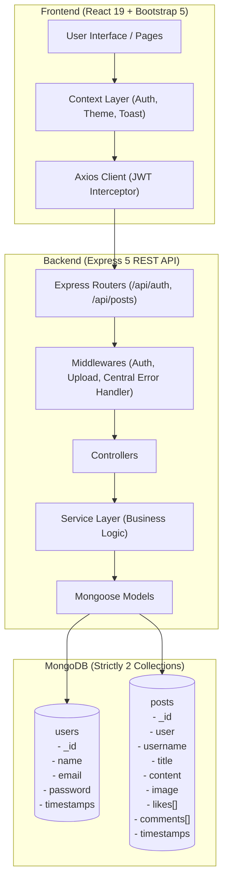

# PostHub — Social Post Management Platform

> A production-style full-stack social post management platform built with React, Node.js, Express, and MongoDB.

[](https://reactjs.org/)
[](https://nodejs.org/)
[](https://expressjs.com/)
[](https://www.mongodb.com/)
[](https://getbootstrap.com/)
[](LICENSE)

---

## 📖 Overview

**PostHub** is a clean, modern social post management platform designed to deliver a smooth social community experience. Users can publish text, photos, or combined posts, discover updates from the community in a public social feed, interact with instant optimistic likes and comments, search and sort posts, and track their engagement statistics through a dedicated profile dashboard.

---

## ✨ Features

- **JWT Authentication**: Secure user registration, credential validation, stateless session persistence, and bcrypt password hashing.
- **Strict Two-Collection Database Architecture**: Entire platform is powered by strictly **two** MongoDB collections (`users` and `posts`), with likes and comments embedded directly inside post documents.
- **Flexible Post Creation**: Supports text-only, image-only, or text + image posts with optional titles, character counters, and strict empty-post validation.
- **Public Social Feed**: Community feed displaying posts from all users with newest posts first.
- **Server-Side Pagination**: Efficient pagination via `skip()`, `limit()`, and `countDocuments()`, offering a fluid "Load More" experience.
- **Real-Time Search & Multi-Criteria Sorting**: Debounced search across author usernames, post titles, and content, alongside sorting by `Latest`, `Most Liked`, and `Most Commented`.
- **Instant Optimistic Interactions**:
  - **Likes & Unlikes**: Atomic MongoDB updates (`$addToSet` and `$pull`) preventing duplicate likes and race conditions, with instant UI updates and error rollback.
  - **Comments**: Inline comment composer with character limit tracking (500 chars) and instant optimistic state updates.
- **Author-Only Authorization**: Backend-enforced ownership validation for editing and deleting posts with a native Bootstrap confirmation modal.
- **Dynamic Profile Analytics**: Automatically calculates total posts created, likes received, and comments received on the author's posts without separate collections.
- **SaaS-Grade Visual Design**: Styled with React Bootstrap, Bootstrap 5, and a custom CSS design system — **100% free of Tailwind CSS**.
- **Dark & Light Mode**: Built-in theme switcher with `localStorage` persistence that styles cards, inputs, modals, and navigation seamlessly.
- **Skeleton Loaders & Toast Feedback**: Native CSS shimmer skeletons on feed loading and non-intrusive Bootstrap toasts for user notifications.
- **Image Lightbox**: Clickable post media with modal lightbox preview and automatic broken-image fallbacks.
- **React Error Boundary**: Graceful runtime error catching ensuring application reliability.

---

## 🛠️ Tech Stack

### Frontend
- **React.js** (v19)
- **Bootstrap 5 & React Bootstrap**
- **Custom CSS** (CSS Variables, theme tokens, micro-animations)
- **Axios** (Central interceptor for JWT authorization)
- **React Router** (v7)
- **React Icons** (Feather icons)

### Backend
- **Node.js** (ES Modules)
- **Express.js** (v5)
- **JSON Web Tokens (JWT)** for stateless authentication
- **Bcrypt** for password encryption
- **Multer & Cloudinary Storage** for image processing and hosting

### Database
- **MongoDB** (Atlas / Local)
- **Mongoose** (ODM)

---

## 📐 Architecture & Data Flow



---

## 🗄️ Database Design

The system enforces a strict **two-collection** constraint:

```text
MongoDB
│
├── users
│   ├── _id (ObjectId)
│   ├── name (String)
│   ├── email (String, unique, lowercase)
│   ├── password (String, bcrypt hashed)
│   └── timestamps (createdAt, updatedAt)
│
└── posts
    ├── _id (ObjectId)
    ├── user (ObjectId, ref: "User")
    ├── username (String, cached author name)
    ├── title (String, optional)
    ├── content (String, optional)
    ├── image (String, optional Cloudinary URL)
    ├── likes [
    │     └── { userId: ObjectId, username: String }
    │   ]
    ├── comments [
    │     └── { userId: ObjectId, username: String, text: String, createdAt: Date }
    │   ]
    └── timestamps (createdAt, updatedAt)
```

### Why Embed Likes and Comments?
1. **Document Locality**: Loading a post along with its social reactions requires a single indexed query instead of multiple joins across collections.
2. **Atomic Updates**: MongoDB's `$addToSet` and `$pull` operators guarantee atomic like/unlike mutations, eliminating race conditions without distributed locks.
3. **Optimized Scaling**: For typical social cards, bounded embedded comments and likes deliver superior read performance.

---

## 🔐 Authentication

Authentication is implemented using stateless **JSON Web Tokens (JWT)**:
1. User registers or logs in with email and password.
2. Server validates credentials against the bcrypt hash.
3. Server returns a signed JWT containing the user's `id` with a 1-day expiration.
4. Client stores the token in `localStorage` and automatically attaches it to outgoing requests via an Axios request interceptor (`Authorization: Bearer <token>`).
5. Protected endpoints pass through `authMiddleware`, verifying the signature and querying the authenticated user.

---

## 🔌 API Endpoints

### Authentication & Profile (`/api/auth`)

| Method | Endpoint | Auth | Description |
| :--- | :--- | :---: | :--- |
| `POST` | `/api/auth/register` | Public | Register new user account |
| `POST` | `/api/auth/login` | Public | Authenticate user & receive JWT |
| `GET` | `/api/auth/profile` | Bearer JWT | Fetch current user profile with calculated stats |
| `PUT` | `/api/auth/profile` | Bearer JWT | Update user name or email |

### Posts Management (`/api/posts`)

| Method | Endpoint | Auth | Description |
| :--- | :--- | :---: | :--- |
| `GET` | `/api/posts` | Public | Get public feed (supports `page`, `limit`, `search`, `sort`) |
| `POST` | `/api/posts` | Bearer JWT | Create post (multipart/form-data: title, content, image) |
| `PUT` | `/api/posts/:id` | Bearer JWT (Owner) | Update own post |
| `DELETE`| `/api/posts/:id` | Bearer JWT (Owner) | Delete own post |
| `POST` | `/api/posts/:id/like` | Bearer JWT | Atomically toggle like/unlike |
| `POST` | `/api/posts/:id/comments` | Bearer JWT | Add a comment to a post |

---

## 📸 Screenshots

*(Add project screenshots here)*

- **Feed (Light & Dark Mode)**: Community posts with full interactive cards.
- **Create Post Composer**: Clean interface with image preview and character limits.
- **User Profile**: Activity overview and engagement analytics.
- **Authentication**: Responsive Login and Signup with password visibility toggle.

---

## 💻 Local Development Setup

### Prerequisites
- Node.js >= 18
- MongoDB (local instance or MongoDB Atlas connection URI)
- npm or yarn

### 1. Clone the repository
```bash
git clone https://github.com/your-username/Post_Management_Web_App.git
cd Post_Management_Web_App
```

### 2. Configure Environment Variables
Copy `.env.example` templates to `.env` in both `backend` and `frontend` directories:

```bash
# Backend
cp backend/.env.example backend/.env

# Frontend
cp frontend/.env.example frontend/.env
```

### 3. Backend Setup
```bash
cd backend
npm install
npm run dev
```
*Backend runs on `http://localhost:5000`.*

### 4. Frontend Setup
```bash
cd ../frontend
npm install
npm run dev
```
*Frontend runs on `http://localhost:5173`.*

---

## 🧪 Testing

The backend includes an automated test suite executed via Node's native `node:test` runner:

```bash
cd backend
npm test
```

### Verified Scenarios:
- ✅ Strict two-model MongoDB verification (`User`, `Post`).
- ✅ Embedded `likes` and `comments` schema validation.
- ✅ Registration input validation & missing field rejection (HTTP 400).
- ✅ Login credential validation & invalid credential rejection.
- ✅ Empty post rejection (must contain text, image, or both).
- ✅ Invalid MongoDB ObjectId rejection.
- ✅ Empty and oversized (>500 chars) comment rejection.
- ✅ Non-owner post update and delete rejection (HTTP 403).

To run the frontend production build and linter:
```bash
cd frontend
npm run lint
npm run build
```

---

## 🚢 Deployment

### Frontend (Vercel / Netlify)
1. Link your GitHub repository.
2. Root directory: `frontend`
3. Build command: `npm run build`
4. Output directory: `dist`
5. Set Environment Variable: `VITE_API_URL=https://your-backend.onrender.com`

### Backend (Render / Railway)
1. Create a Web Service from the repository.
2. Root directory: `backend`
3. Build command: `npm install`
4. Start command: `node server.js`
5. Configure Environment Variables:
   - `PORT=5000`
   - `MONGO_URI=mongodb+srv://...`
   - `JWT_SECRET=...`
   - `CLOUDINARY_CLOUD_NAME=...`
   - `CLOUDINARY_API_KEY=...`
   - `CLOUDINARY_API_SECRET=...`

### Database (MongoDB Atlas)
- Create a free M0 cluster on MongoDB Atlas.
- Add Network Access IP: `0.0.0.0/0` (for cloud server access).
- Create database user and obtain the standard connection URI.

---

## 🛡️ Security Best Practices

1. **Password Hashing**: Passwords are encrypted using `bcrypt` (10 rounds) and stripped from all database projections and API responses.
2. **Authorization Guards**: Authoritative server-side ownership checks prevent users from altering or deleting posts authored by others.
3. **Atomic Mutations**: `$addToSet` and `$pull` prevent duplicate likes and race conditions.
4. **Input & Upload Validation**: Strict file type filtering (`image/jpeg`, `image/png`, `image/webp`), 5MB file size limit, and comment length caps.
5. **Secret Hygiene**: `.env` files are ignored by git; `.env.example` templates contain only non-sensitive placeholders.

---

## 🔮 Future Improvements

- Bookmark/Save post capability (embedded inside user document).
- Infinite scroll option alongside current Load More button.
- User profile avatars with Cloudinary photo upload.
- Full-text MongoDB search index for large-scale deployments.

---

## 👤 Author

**Naina Varshney**  
*Full-Stack / Frontend Developer*
