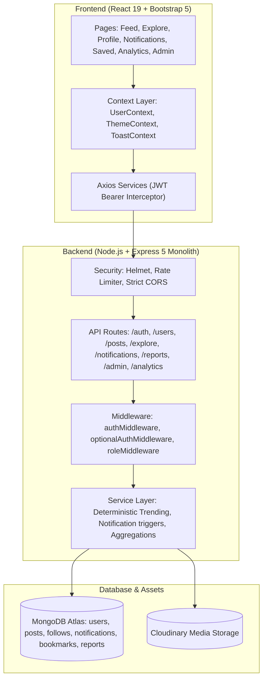

# PostHub 2.0 — Production-Style Social Community & Content Platform

> A full-scale, portfolio-grade social community platform built with **React**, **Node.js**, **Express**, **MongoDB**, and **Cloudinary**.

[](https://reactjs.org/)
[](https://nodejs.org/)
[](https://expressjs.com/)
[](https://www.mongodb.com/)
[](https://getbootstrap.com/)
[](https://github.com/naina766/PostDashboardApp/actions)
[](LICENSE)

---

## 📖 Product Vision & Overview

**PostHub 2.0** evolves from a basic post management application into a production-style social community platform. Combining patterns from developer networks, community forums, and content platforms, PostHub provides an engaging community experience while maintaining its own distinct visual identity.

The platform is designed with a **modular monolithic backend** and a **component-driven React frontend**, adhering to clean code principles, predictable state management, and real-world scalability.

---

## ✨ Features by Phase

### 1. Social Profile System
- **Rich User Profiles**: Display names, unique `@username`, custom avatars, cover photos, bio (up to 300 chars), location, website, skill badges, and social links (GitHub, Twitter, LinkedIn).
- **Direct Image Uploads**: Cloudinary-backed avatar and cover photo uploads.
- **Followers / Following Counters**: Live graph counts with dedicated modals listing followers and following accounts.
- **Profile Content Tabs**: Categorized tabs for "Posts", "Media", and "Saved".

### 2. Follow & Social Graph
- **Bidirectional Relationship**: Follow and unfollow users with optimistic UI updates.
- **Self-Follow & Duplicate Prevention**: Server-enforced compound index `{ follower: 1, following: 1 }` preventing invalid self-relationships or duplicate follows.
- **Suggested Users to Follow**: Recommends creators based on follower count while excluding already-followed members.

### 3. Advanced Post System
- **Multi-Format Content**:
  - **Standard Text**: Markdown-compatible content with character tracking.
  - **Multi-Media**: Support for up to 4 images per post with modal lightbox expander.
  - **Interactive Polls**: Community polls with custom questions, expiration timestamps, and live percentage calculation.
  - **Link Cards**: Rich destination preview with hostname, title, and summary.
- **Automatic Hashtag & Mention Extraction**: Regex parser extracting `#hashtags` and `@mentions` into normalized database indices.
- **Draft Auto-Saving**: Drafts are continuously cached in `localStorage` so in-progress posts are never lost.

### 4. Threaded Discussions (Level 2)
- **Nested Comments & Replies**: 2-level discussion threads (`Post` → `Comment` → `Reply`).
- **Comment Likes**: Community members can react and like individual comments.
- **Granular Deletion**: Comment authors, post authors, and administrators can remove comments.

### 5. Bookmark & Saved Collection
- **Personalized Bookmarks**: Dedicated `Bookmark` collection with unique indexing (`{ user: 1, post: 1 }`).
- **One-Click Saving**: Quick bookmark toggle with optimistic UI feedback.
- **Saved Posts View**: Fast access to bookmarked posts via `/saved`.

### 6. Explore & Global Server Search
- **Trending Posts & Topics**: Deterministic ranking score highlighting hot discussions.
- **Hashtag Feeds**: Filter and explore posts dedicated to specific topics (e.g. `/explore?tag=react`).
- **Debounced Server-Side Search**: Fast search across users, posts, and hashtags without fetching the whole database into the browser.

### 7. Deterministic Trending Engine
PostHub does **not** rely on fake mock algorithms or ungrounded claims of machine learning. Post ranking is computed deterministically using the following formula:

$$\text{TrendingScore} = (\text{likes} \times 1) + (\text{comments} \times 3) + (\text{shares} \times 4) + (\text{saves} \times 3) + \text{RecencyBonus}$$

Where $\text{RecencyBonus} = \max(0, 100 - \text{hoursSinceCreation} \times 1.5)$.

### 8. Notification Center
- **Real-Time Event Tracking**: In-app notifications triggered for likes, comments, replies, follows, mentions, and bookmarks.
- **Unread Badge & Polling**: Unread badge counter in the navigation bar.
- **Status Updates**: Mark individual notifications as read or mark all as read simultaneously.

### 9. Safety & Moderation
- **Content & User Reporting**: Flag posts, comments, or users for Spam, Harassment, Hate Speech, Violence, Inappropriate content, or Misleading information.
- **Audit-Ready Reports**: Every report records the reporter, target entity, timestamp, and status (`PENDING`, `RESOLVED`, `DISMISSED`).

### 10. Administration Dashboard (`/admin`)
- **Server-Side RBAC**: Strict role enforcement (`admin`, `moderator`, `user`).
- **Platform Telemetry**: Monitor total users, total posts, pending reports, and active posts created in the last 24 hours.
- **User Governance**: Search users, promote/demote roles, or suspend abusive accounts.
- **Content Moderation**: Review reported posts and resolve or dismiss flags.

### 11. Creator Analytics (`/analytics`)
- **Performance KPIs**: Total posts, likes received, comments received, saves, and engagement rate per post.
- **Format Breakdown**: Visual breakdown of Text, Media, Poll, and Link posts.
- **Top 5 Performing Posts**: Quick sorting of top-performing content.
- **6-Month Activity Timeline**: Visual monthly posting frequency.

### 12. Security Hardening
- **Helmet**: Secures HTTP headers (`crossOriginResourcePolicy: false` configured for static media).
- **Express Rate Limiting**: Strict burst protection for authentication (50 req / 15 min) and API requests (500 req / 15 min).
- **Sanitized Responses**: Password hashes and sensitive credentials are never leaked in API envelopes.

---

## 🏛️ System Architecture



---

## 🗄️ Database Design (V2 Collections)

PostHub 2.0 uses 6 clean, decoupled collections to prevent document bloat and ensure fast query times:

| Collection | Key Responsibilities | Primary Indexes |
| :--- | :--- | :--- |
| `users` | Auth credentials, social profile, follower counts, role | `{ email: 1 }`, `{ username: 1 }` |
| `posts` | Post content, media array, poll subdocument, link preview, hashtags | `{ createdAt: -1 }`, `{ trendingScore: -1 }`, `{ hashtags: 1 }` |
| `follows` | User-to-user social graph | `{ follower: 1, following: 1 }` (unique compound) |
| `notifications` | Social interaction notifications | `{ recipient: 1, read: 1, createdAt: -1 }` |
| `bookmarks` | Post saving / bookmarks | `{ user: 1, post: 1 }` (unique compound) |
| `reports` | Community safety flags and moderation audit log | `{ status: 1, createdAt: -1 }`, `{ targetId: 1 }` |

---

## 🚀 Quick Start (Local Setup)

### Prerequisites
- **Node.js** (v20 or higher)
- **MongoDB** (Local instance or MongoDB Atlas URI)
- **Cloudinary Account** (for media uploads)

### 1. Clone Repository
```bash
git clone https://github.com/naina766/PostDashboardApp.git
cd PostHub
```

### 2. Configure Environment Variables
Copy `.env.example` in both `backend` and `frontend`:

**`backend/.env`**:
```env
PORT=5000
MONGO_URI=your_mongodb_connection_string
JWT_SECRET=your_secure_jwt_secret
CLOUDINARY_CLOUD_NAME=your_cloud_name
CLOUDINARY_API_KEY=your_api_key
CLOUDINARY_API_SECRET=your_api_secret
```

**`frontend/.env`**:
```env
VITE_API_URL=http://localhost:5000/api
```

### 3. Install & Run Backend
```bash
cd backend
npm install
npm run dev
```

### 4. Install & Run Frontend
```bash
cd ../frontend
npm install
npm run dev
```

Visit `http://localhost:5173` to experience PostHub 2.0!

---

## 🐳 Docker Deployment

PostHub includes container configurations for production:

```bash
# Build and run containers in background
docker-compose up --build -d

# Check running services
docker-compose ps

# Tear down containers
docker-compose down
```

Services exposed:
- Frontend: `http://localhost:3000`
- Backend API: `http://localhost:5000`
- MongoDB: `localhost:27017`

---

## 🧪 Automated Testing

PostHub 2.0 has comprehensive unit and integration tests covering:
- Database architecture & 6 social models
- User authentication & password protections
- Multi-format post validations & poll restrictions
- Hashtag & mention parser correctness
- Deterministic trending score calculation
- Threaded 2-level comment & reply limits
- Follow graph constraints & self-follow prevention
- Report categorization
- Administrator authorization and RBAC

Run the test suite:
```bash
cd backend
npm test
```

Frontend linter and build check:
```bash
cd frontend
npm run lint
npm run build
```

---

## 📚 API Reference

Complete documentation for all endpoints is available in [`docs/API.md`](docs/API.md).  
A full Postman collection is also provided at [`PostManagementApp.postman_collection.json`](PostManagementApp.postman_collection.json).

### Health Endpoint
```http
GET /api/health
```
```json
{
  "status": "ok",
  "service": "posthub-api",
  "version": "2.0.0",
  "timestamp": "2026-09-06T11:20:00.000Z",
  "uptime": 234.12
}
```

---

## 🛡️ License

This project is licensed under the MIT License — see the [LICENSE](LICENSE) file for details.
