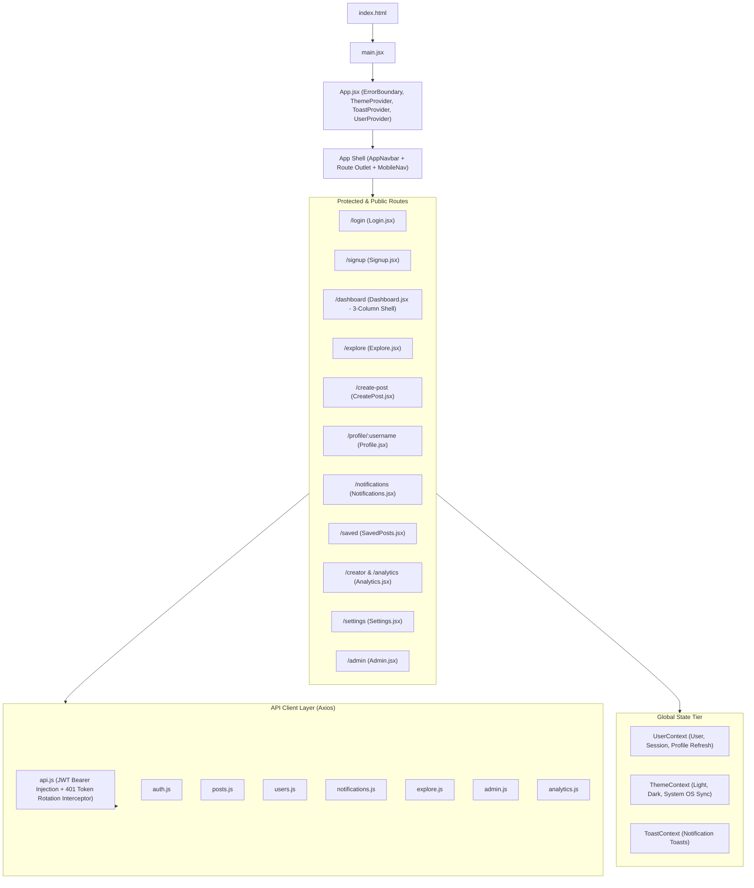

# PostHub 3.0 — Frontend Architecture & UI Audit

## 1. Executive Summary

PostHub 3.0's frontend is a modern Single Page Application (SPA) built with **React 19**, **Vite**, **Bootstrap 5.3**, and **React-Bootstrap**. It combines component-driven modularity with a centralized CSS custom property (design token) system, client-side session management with automatic JWT refresh rotation, and an accessible, responsive layout.

---

## 2. Current Architecture & Component Hierarchy

---

## 3. Component Inventory & Responsibility Breakdown

| Path | Component | Responsibility |
| :--- | :--- | :--- |
| `src/components/Navbar.jsx` | `AppNavbar` | Top navigation, global search bar, notification counter badge, active route highlighting, theme toggle, and create CTA. |
| `src/components/BottomNav.jsx` | `BottomNav` | Mobile-first fixed bottom navigation drawer (Home, Explore, Create, Alerts, Profile) active $\le 768$px. |
| `src/components/Sidebar.jsx` | `LeftSidebar` & `RightWidgets` | Desktop persistent navigation, trending hashtags, suggested creators, and community telemetry widgets. |
| `src/components/PostCard.jsx` | `PostCard` | Unified post rendering: multi-media gallery, polls, link previews, hashtags, optimistic like/save/follow, and 2-level threaded comments. |
| `src/components/PostSkeleton.jsx` | Skeletons | Shimmer skeleton placeholders for posts, profiles, notifications, and analytics to prevent Cumulative Layout Shift (CLS). |
| `src/components/EmptyState.jsx` | `EmptyState` | Consistent empty feedback across empty feeds, zero search results, and empty saved lists. |
| `src/components/ErrorState.jsx` | `ErrorState` | User-friendly error recovery UI with retry triggers. |

---

## 4. Key Findings & Recommended Improvements

1. **Design System Consistency**:
   * Standardize all semantic CSS variables under the `--ph-*` namespace (e.g. `--ph-bg-page`, `--ph-surface`, `--ph-primary`, `--ph-border`).
   * Preserve Bootstrap 5 utilities while avoiding hardcoded ad-hoc hex values. Zero TailwindCSS.
2. **Global App Shell & Responsive Layout**:
   * Desktop ($> 992$px): Modern 3-column layout (Left Nav, Center Feed, Right Trending/Suggestions).
   * Mobile ($\le 768$px): Bottom navigation bar providing $44$px+ touch targets without cluttering the viewport.
3. **Optimistic Engagement with Rollback**:
   * Ensure likes, bookmarks, and follow toggles update state instantaneously, rolling back gracefully with a toast notification if the API call rejects.
4. **Performance & Route-Level Code Splitting**:
   * Implement `React.lazy` and `Suspense` across route boundaries to minimize initial bundle size and speed up Time to Interactive (TTI).
5. **Accessibility**:
   * Ensure all buttons, icon triggers, and modals feature `aria-label`, visible focus indicators, and support keyboard navigation (ESC, Enter, Tab).
