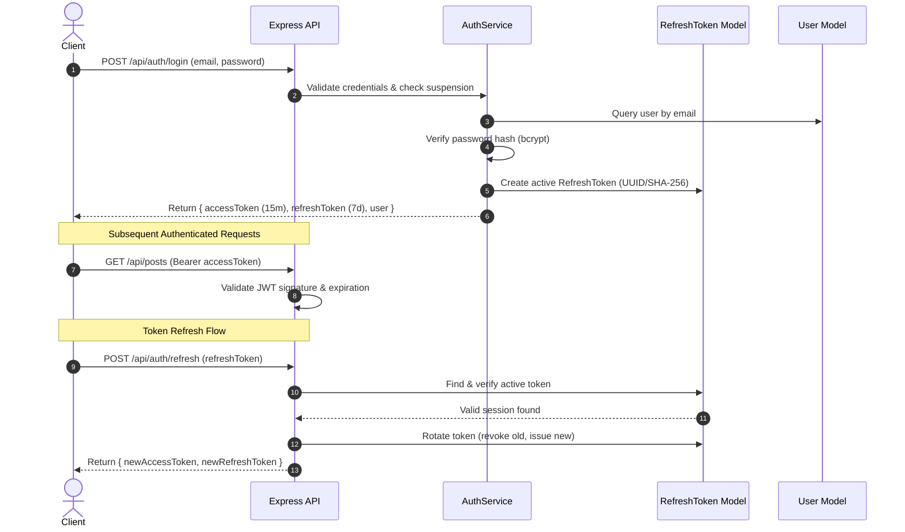
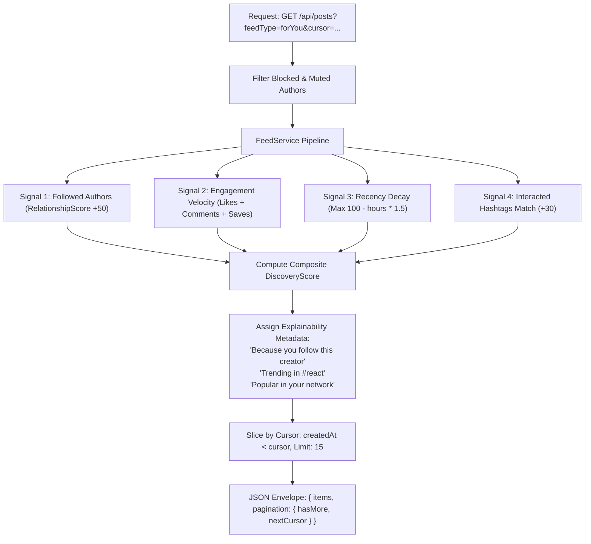

# PostHub 3.0 — Enterprise-Grade Social Community Platform Architecture

## 1. Executive Summary & Product Vision

**PostHub 3.0** is an enterprise-style, full-scale social content and community platform built for creators, engineers, and knowledge-sharing communities. Evolving from a standard CRUD application into a production-style modular monolith, PostHub 3.0 demonstrates advanced patterns in:
- High-concurrency social graph mechanics (bidirectional follows, mutual connections, blocking, muting)
- Hybrid feed generation (cursor-based pagination, deterministic discovery scoring with explainable recommendation signals)
- Unbounded vs. bounded data modeling (modular comment sub-documents vs. high-growth references)
- Resilient session security (dual JWT architecture with refresh token rotation and revocation)
- Server-side role-based access control (RBAC), community safety, and compliance audit logging

---

## 2. Current Architecture vs. Target Architecture

### 2.1 Problems Identified in V2 Audit
1. **Oversized Documents Risk**: Embedding all post likes, comments, and replies in a single document causes document size bloat toward MongoDB's 16MB BSON limit for viral posts.
2. **Offset Pagination Inefficiencies**: Using `skip()` on large collections causes $O(N)$ scan overheads and duplicate/skipped items when new posts are inserted concurrently.
3. **Session Fragility**: Single long-lived JWTs lack revocation capability without invalidating all sessions across devices.
4. **Missing Social Boundary Enforcement**: Blocks and mutes were not strictly filtered out across global search, notifications, and feed generation.
5. **Feed Coupling**: Feed ranking algorithms were directly embedded in controllers rather than encapsulated within an extensible `FeedService`.

### 2.2 Target Architecture (PostHub 3.0 Modular Monolith)
```
                          ┌──────────────────────────┐
                          │  React 19 Client (SPA)   │
                          │ Bootstrap 5 + CSS Tokens │
                          └─────────────┬────────────┘
                                        │ HTTPS / JWT + Refresh
                                        ▼
                          ┌──────────────────────────┐
                          │  Express 5 API Gateway   │
                          │ Helmet, Rate Limit, CORS │
                          └─────────────┬────────────┘
                                        │
           ┌────────────────────────────┼────────────────────────────┐
           ▼                            ▼                            ▼
┌─────────────────────┐      ┌─────────────────────┐      ┌─────────────────────┐
│    Auth & Users     │      │   Feeds & Posts     │      │ Discovery & Search  │
│  - Session Service  │      │  - FeedService      │      │  - SearchService    │
│  - User Service     │      │  - Cursor Pagination│      │  - Trending Engine  │
│  - Graph & Blocks   │      │  - Draft & Archive  │      │  - Hashtags Engine  │
└──────────┬──────────┘      └──────────┬──────────┘      └──────────┬──────────┘
           │                            │                            │
           └────────────────────────────┼────────────────────────────┘
                                        │
           ┌────────────────────────────┼────────────────────────────┐
           ▼                            ▼                            ▼
┌─────────────────────┐      ┌─────────────────────┐      ┌─────────────────────┐
│    Notifications    │      │ Safety & Moderation │      │ Observability & Ops │
│  - Delivery Service │      │  - Report Service   │      │  - Health Telemetry │
│  - Aggregation      │      │  - Audit Service    │      │  - Structured Logs  │
└──────────┬──────────┘      └──────────┬──────────┘      └──────────┬──────────┘
           │                            │                            │
           ▼                            ▼                            ▼
┌───────────────────────────────────────────────────────────────────────────────┐
│                 Data Tier: MongoDB Atlas + Cloudinary Storage                 │
│ Collections: users, posts, comments, follows, bookmarks, notifications,       │
│              reports, audit_logs, refresh_tokens                              │
└───────────────────────────────────────────────────────────────────────────────┘
```

---

## 3. Database Architecture & Schema Evolution

### 3.1 Unbounded vs. Bounded Modeling Decision
- **Bounded (Embedded)**:
  - Poll questions & options (strictly capped at 6 options).
  - Media asset metadata (capped at 4 items per post).
  - Normalizing hashtags & mentions (extracted array of strings).
- **Unbounded / High-Growth (Referenced)**:
  - `comments`: Decoupled into its own collection or structured subdocuments with strict pagination limits to allow threaded level-2 replies without loading unbounded megabytes per post.
  - `refresh_tokens`: Tracked in a dedicated collection for session revocation, multi-device tracking, and automatic expiration (TTL index).
  - `audit_logs`: Dedicated immutable compliance collection for security actions (suspension, role escalation, content takedown).

### 3.2 Collection Specifications
1. `users`: Identity, authentication credentials, profile metadata, privacy toggles, blocked/muted lists.
2. `posts`: Content, status (`PUBLISHED`, `DRAFT`, `ARCHIVED`), postType, media, poll, linkPreview, hashtags, mentions, metrics counters (`likesCount`, `commentsCount`, `savesCount`), and `trendingScore`.
3. `follows`: Social edges (`follower`, `following`) with compound unique indexing.
4. `bookmarks`: Saved posts (`user`, `post`) with compound unique indexing.
5. `notifications`: In-app event delivery with aggregation support and TTL/read indices.
6. `reports`: Moderation tickets (`reporter`, `targetType`, `targetId`, `reason`, `status`, `details`).
7. `audit_logs`: Immutable security log (`actor`, `action`, `targetType`, `targetId`, `details`, `ip`, `userAgent`).
8. `refresh_tokens`: Cryptographic refresh tokens with device metadata, revoked flags, and automatic TTL expiration.

---

## 4. End-to-End Data & Flow Diagrams

### 4.1 Authentication & Session Flow


### 4.2 Intelligent Feed Generation Flow (With Explainability)


---

## 5. Security & Governance Architecture

1. **Defense in Depth**:
   - HTTP Security: Helmet with explicit CSP/CORP rules.
   - Rate Limiting: 50 requests/15m for authentication; 500 requests/15m for standard APIs.
   - Input Sanitization: Centralized Express validator rejecting SQL/NoSQL injection payloads and script tags.
2. **Audit Logging & Governance**:
   - Privileged operations (role update, account suspension, post takedown) trigger asynchronous immutable `AuditLog` writes.
   - Moderator identities, IP traces, and action rationales are permanently archived.
3. **Session Revocation**:
   - Users can execute "Log out from all sessions" (`POST /api/auth/logout-all`), immediately invalidating all refresh tokens.

---

## 6. Scaling Roadmap & Phased Execution

- **Phase A**: Session Security (Dual Access/Refresh JWT, session revocation, logout-all).
- **Phase B**: Social Graph Isolation (Server-side block/mute filtering, mutual connection computation).
- **Phase C**: Modular `FeedService` with Cursor-based pagination and Explainable Discovery Engine.
- **Phase D**: Content Management Lifecycle (Drafts, Archiving, Soft-Deletes).
- **Phase E**: Moderation Audit Trail (`audit_logs`) & Enhanced Admin Telemetry.
- **Phase F**: Account Settings (`/settings`: Privacy, Security, Notifications, Theme).
- **Phase G**: Automated Test Expansion, Load Documentation (`docs/SCALABILITY.md`), and Production Verification.
